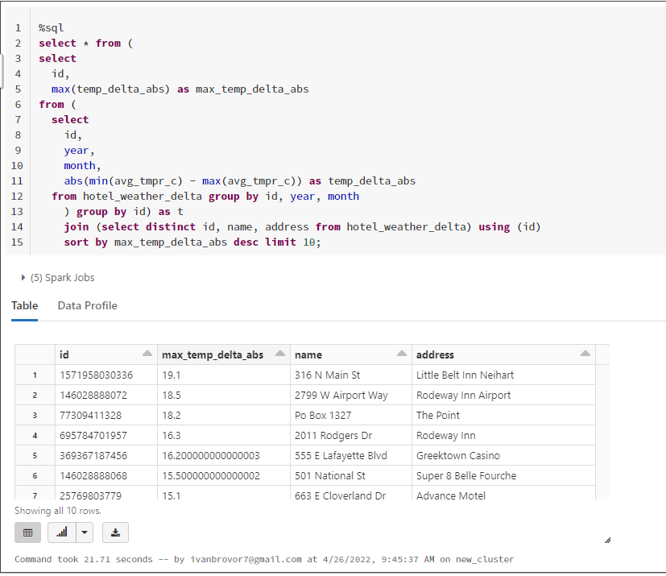

# Installation
```bash
git clone https://github.com/Vlad-Misiukevich/m07_sparksql_python_azure.git
```
# Requirements
* Python 3.8
* Windows OS
* azure-cli
* terraform
# Usage
1. Login to Azure  
`az login`
2. Deploy infrastructure with terraform  
`terraform init`  
`terraform plan -out terraform.plan`  
`terraform apply terraform.plan`

# Description  
1. Copy data to Azure ADLS gen2 storage.
  
2. Create delta tables based on data in storage account.  
  
  
3. Using Spark SQL calculate and visualize tasks:  
* Top 10 hotels with max absolute temperature difference by month  
  
  
* Weather trend for visits with extended stay  
  
  
4. Deploy Databricks Notebook on cluster 


5. Store data in storage container.  

